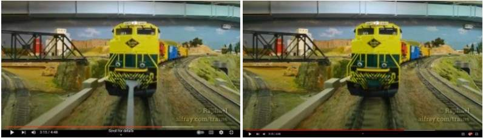
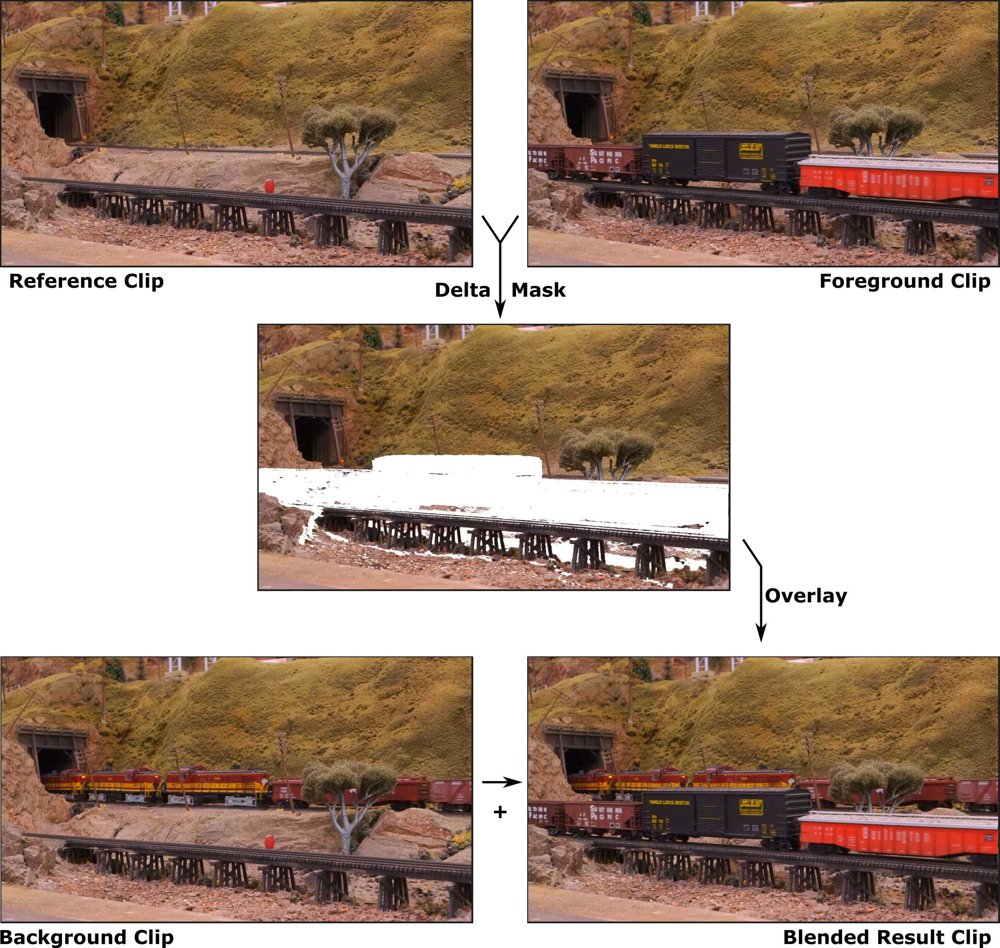

# Ralf's Video Plugins

## DaVinci Resolve/Fusion

### Ralf Cam Car Rod Removal (Fuse)

This Fuse detects and removes the gray rod from a camera car attached to HO model trains.

Fuse: [`RalfCamCarRodRemoval.fuse`](./fusion/fuses/RalfCamCarRodRemoval.fuse)

Description: [RalfCamCarRodRemoval.md](./fusion/fuses/RalfCamCarRodRemoval.md) for full details.

---

### Ralf Delta Mask (Fuse)

This Fuse is a mix between a Delta Keyer, a Difference Keyer, and a Merge node.
It's a direct recreation in Fusion of the LightWorks FX Shader I wrote years ago (see below).

Fuse: [`RalfDeltaMask.fuse`](./fusion/fuses/RalfDeltaMask.fuse)

Description: [RalfDeltaMask.md](./fusion/fuses/RalfDeltaMask.md) for full details.

---

## LightWorks

The following FX shader was written for LightWorks 12.0.

### Ralf Delta Mas Blend (FX Shader)

This FX Shader is a 1-pass delta keyer combined with a mask & overlay merge operation.

FX Shader: [`ralf_delta_mask_blend.fx`](./lightworks/fx_shaders/ralf_delta_mask_blend.fx)

Description: [blendmask_explanation.jpg](./lightworks/fx_shaders/blendmask_explanation.jpg) for full details.

---

### LWAppNet

OK I'm not going to go into too many details because that one is a bit of an
embarassing case of "when you have a hammer, everything is a nail".
Or more exactly, when you have Cygwin, everything is a bash shell script.

Bear with me here:

* [`lw_stabilize.sh`](./lightworks/scripts/lw_stabilize.sh) :
  LightWorks 12 did not have any stabilization feature.
  However I had made a _bash script_ to manually run the
  [Deshaker](https://www.guthspot.se/video/deshaker.htm) plugin from
  [VirtualDub](https://www.virtualdub.org/) on a command line.
  What this script does is extract the parameters from a LightWorks "external processing"
  node, and call [my stabilization script](./lightworks/scripts/stabilize_mobius.sh)
  with it.
  The generated stabilized script is imported in LightWorks.
* [`LWAppNet.sh`](./lightworks/scripts/LWAppNet.sh) extracts the parameters from a
  LightWorks "external processing" node and then generates a "Composition" for 
  [DaVinci Fusion 8](https://www.blackmagicdesign.com/products/davinciresolve/fusion)
  (back then it wasn't integrated in [DaVinci Resolve](https://www.blackmagicdesign.com/products/davinciresolve) yet.) Then it sets up everything so that the result of
  Fusion is directly usable in LightWorks.

The scripts are a bit overcomplicated because they need to deal with pre- and post-
transitions, as well as transforming the timestamps into whatever the target needs,
dealing with temp files, and needing to be idempotent when called multiple times.

Fun fact: LightWorks does not pass any arguments to the external script, at least
nothing on the command line. Instead it writes into a unique `%Documents% sources-list.txt`
file, thus the script needs to duplicate that as the info will be overwritten when
another external tool is invoked.

But now there was a problem, namely that LightWorks can't call a Cygwin shell script
directly. Well, that's where we get the last piece of the puzzle:

* [LWAppNet](./lightworks/export/LWAppNet/) is a C# Project that creates a very small
  executable that does one thing and one thing only: when invoked as `LWAppNet.exe` by
  LightWorks, it executes a `LWAppNet.bat`.
* In turn, the [`LWAppNet.bat`](./lightworks/scripts/LWAppNet.bat) calls `LWAppNet.sh`
  using Cygwin.

Thus the workflow is LightWorks > select a clip > Add > Effect > Plugins > "LW App Net",
and then we have a fun chain of trampolines: 
LightWorks executes `LWAppNet.exe`
which executes `cmd /c LWAppNet.bat`
which executes Cygwin with `bash -i ~/bin/LWAppNet.sh`.
In the end, all I had to do is rename whatever shell script
I wanted as `LWAppNet.sh` and I could invoke it from LightWorks. Yeah... >:-/ !

~~