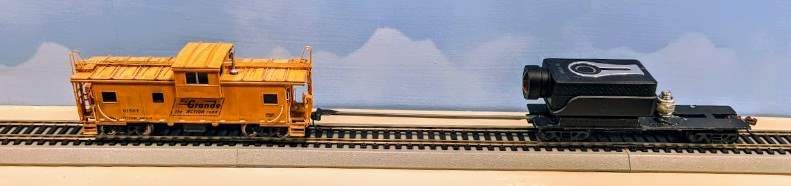

# Camera Car Rod Removal Fuse

## Overview

When filming HO trains, I often run a camera car behind or in front on the train
attached with a gray rod. It looks like this:

The rod is fairly visible on the video, and quite distracting.
The goal of this Fuse plugin is to erase it from the image:

## TL;DR

A short overview of _what_ this does is written here: 

https://www.alfray.com/trains/blog/train/2023-06-04_davinci_resolve_plugin_for_t_4126bb12.html

The rest of this document focuses on usage explanations, and implementation details.

## Instalation

To install, copy the Fuse file in
`%APPDATA%\Blackmagic Design\DaVinci Resolve\Support\Fusion\Fuses\`
a.k.a.
`C:\Users\%USERNAME%\AppData\Roaming\Blackmagic Design\DaVinci Resolve\Support\Fusion\Fuses\`
 and then restart DaVinci Resolve.

## Usage Guide

Before we dig into usage details, a general warning is needed:
this is all "old school" image analysis. There's no AI or ML (machine learning)
with a magic wand that magically solves everything here.
The process is fairly manual and intensive. It involves setting up trackers and
carefully adjusting animated threshold parameters to get the desired effect.

### Step 1: Top rod tracker

For each clip, start by tracking a reference point which will become the origin for the removal scanning process.
* Name the tracker tool “RodTracker” and the inside Tracker 1 to “Base” or “RodTop”.
* As an example (see below), in the case of the Santa Fe engine,
  I chose a point where the rod intersects the bottom of the front snowplow.
  That point is the bottom of where the rod will vanish -- it will be visible above.
* Tracking worked well with a 2-frame step.
* Tracking pattern is a square (0.03 x 0.05) against (0.1 x 0.2) search area.
* Or try a square pattern (0.03 x 0.03) against (0.1 x 0.1) search area
* A smaller search area is faster to track,
  but it can miss if there’s a lot of movement and a high frame step.

[ TBD insert tracker image ]

### Step 2: Add the Ralf Cam Car Rod Removal tool

* Add `Tool` > `Transform` > `Ralf Cam Car Rod Removal`.
* The top point is not tracked. It is computed using an expression:
  * `OriginPoint + Point(0, 0.005+TopBlendingHeight)`
* `TopBlendingHeight` represents how much I want to blend,
  and the 0.005 is just an offset so that it looks good for that use case.
* The “Overlay Point” indicates the height used to display the “Overlay”.
  That’s useful to debug and have an idea of the coefficients to use.
* The overlay is not tracked, either, is uses an expression:
  * `OriginPoint - Point(0, 0.1)`
* I used the same formulas for the front vs rear.

The overlay is just a debug tool. It displays a line representing the
luma detection, as well as the mask.

Example of values used for [1960s Union Pacific 8,500 hp "Big Blow" Gas-Turbine](https://youtu.be/0C642k58EQE) :
* Method = `Method 4`
* Origin Point = `Connect To … RodTrackerTracker1Path > Position`
* Top Point = `OriginPoint + Point(0, 0+TopBlendingHeight)`
* Top Blending Height = 0.03 ⇐ how much to blend ABOVE the tracker base
* Luma Delta = 0.18 ⇐ this is what I adjust most of the time
* Scan Width = 0.03 ⇐ smaller makes it faster; needs larger for curves
* Bottom Fill Height = 0.18 ⇐ just enough not to be visible + some margin
* Fill Static Width = 0.002
* Fill Blend Width = 0.003 or 0.005
* Fill Left/Right = 0.5 (centered)
* Border Smoothing = 0.9
* Center Smoothing = 0.3
* Overlay Point = `OriginPoint - Point(0, 0.1)`

The width and height parameters are multiples of the image's width and height.
In my case, the source media is 4K (3840x2160) and that's what the Fuse processes in Fusion.
The final video is a 1920x1080 center-crop in the Editor, but as far as this Fuse plugin is
concerned, we're dealing with the entire 4K source video.

Above, we tracked the top of the rod. The rod thus extends to the bottom. The points are, from top to bottom in the image:
* The `origin` point is the center of the tracker. Everything else is located _below_ that point.
* The `top` point is the top part rod that will be erased, _below_ the origin point.
  * The `top blending height` is the number of lines above the top point that will be blended
    from 100% opacity down to 0% opacity.
* The `bottom` point is the lowest point were we stop trying to find the rod.
  * Because the source is 4K cropped to 1920x1080, we don't need to process the entirety of the
    video height.
  * `Bottom fill height` is thus the height percentage that we care about. Anything
    below that point is ignored as it will be cropped out, saving processing time.
* The `overlay` point is the height of the line which we use to display the luma profile
  for debug purposes. In general I select a line 10% below the origin point.

[ TBD screenshot with the points highlighted ]

The "method" is the algorithm used:
* Bypass = do nothing. It's a quick way to disable the removal for comparison.
* Flood fill = uses a flood fill algorithm using the luma of the top origin
  point and moving down. This quickly fails if there's a lot of change in the
  rod's luma over the vertical axis, and it also fails if the sides of the rod
  are not distinct enough from the background.
* Method 4 = that's a variaton on the previous method that also uses the geometry
  property of the rod -- we know it's vertical, so it smoothes out irregularities on
  the sides using interpolation and the fact that the rod is centered and of constant
  width; this helps to partially dismiss poor matches.

I use an animated (keyframe) value for the Luma Delta parameter
and adjust it depending on the frame to ensure the rod is properly detected
depending on the background color/illumination.
It can get quite tricky in low-luminosity areas, or with tunnels entrances and exits.

### Step 3: Hiding the coupler

Note: the canonical example is the rear coupler on  [1960s Union Pacific 8,500 hp "Big Blow" Gas-Turbine](https://youtu.be/0C642k58EQE).

* Add a polygon (either square or matching the coupler shape).
  * Be sure to be at the BEGINNING of the Fusion track to edit the polygon, since a polygon is apparently as an animated path by default; editing it at other keyframes will generate a path animation!
  * Filter fast gaussian; soft edge = 0.005; border = 0 or 0.001.
  * Do NOT animate the polygon nor track it directly (do not use “Connect to” with the same rod tracker, because any offset change is done in the original instance).
  * Instead use Polygon > Center > Modify With > Offset Position.
  * This creates a “modifier” that has the position track + an optional offset (that can be animated). Go to the Modifiers tab in the Polygon.
  * Polygon > Modifiers > Position > Connect to > RodTracker > Base/Top: Offset Position. 
  * The first time, edit the polygon to correct the base offset. Can also adjust the offset in the modifier.
* Add a ColorCorrector.
  * Input from rod plugin, mask with polygon.
  * The “Ranges” tab is used to decide what is Shadow / Midtones / Highlights. I keep it unchanged. Changing the “Range = Result” allows one to see which part of the image is which.
  * What matters is the first “Correction” tab.
    * Colors > Master : Unchanged.
    * Colors > Shadows : Unchanged.
    * Colors > Midtones : Sat = 0; Gain = 0.61; Lift = -0.53
    * Colors > Highlights : Sat = 0; Gain = 0.36; Lift = -0.36
  * Doing this darkens the mid/highlights of the coupler but it’s still visible as a shadow.

[ TBD show Fusion graph ]

Another way to achieve this effect is to use a combination of the DaVinci Fusion “Clone Paint” tool and a “Color Node” with an image tracker. This was much slower to compute yet yielded good results where the method above was not enough.

[ TBD show Fusion graph ]

## Limitations and Suggestions

* Avoid tunnels if possible -- or more exactly the in/out transition.
  * It can sometimes be easier to just leave the rod in the tunnel as it’s much less distraction (it’s gray on gray).
  * Use the front vs back to “hide” the transition in/out of the tunnel.
* Going over turnouts results in some weird artifacts since the rod removal also removes the inner divergent rail.
  * Use the front vs back to “hide” going over turnouts.
* In some long curves, it’s impossible to prevent the rod from overlapping the inner or outer rail, creating lots of distracting artifacts.
* When the front rod is very close to the rail, try to reduce the Fill Static Width.

~~

