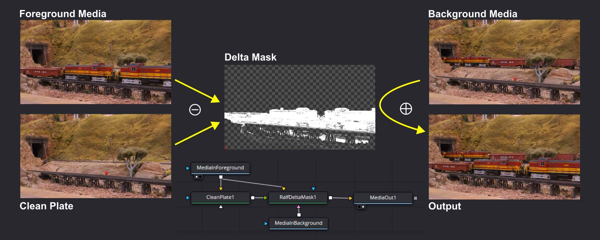
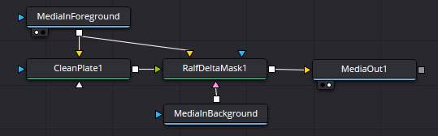
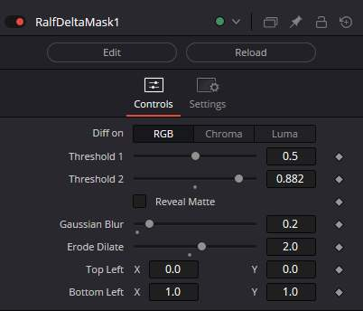

# Ralf Delta Mask Fuse

## Overview

This Fuse essentially recreates a custom-made Difference Keyer combined with a Merge node.
It's a direct recreation in Fusion of the
[LightWorks FX Shader]( ../../README.md#ralf-delta-mask-blend-fx-shader) I wrote years ago.

The goal is to compare a foreground media clip with a reference image to create a mask of what
is moving on the image, and then compose this on top of a background. Here's a visual summary:

TL;DR: 
A foreground clip is subtracted from a clean plate reference to obtain a matte mask
that represents _only what has changed_.
That mask is then used to blend the foreground clip on top of a background clip.

Disclaimer: This can likely be achieved using a Difference Keyer and a Merge node in Resolve.
With my limited knowledge of Fusion, I always struggle to configure a Difference Keyer properly
to get the effect I desire. It's easier for me to program a Fuse that does _exactly_ what I want, which I did.

## Instalation

Fuse file: [`RalfDeltaMask.fuse`](RalfDeltaMask.fuse)

To install, copy the Fuse file in
`%APPDATA%\Blackmagic Design\DaVinci Resolve\Support\Fusion\Fuses\`
a.k.a.
`C:\Users\%USERNAME%\AppData\Roaming\Blackmagic Design\DaVinci Resolve\Support\Fusion\Fuses\`
 and then restart DaVinci Resolve.

## Usage Guide

To use this, we need 2 or 3 media inputs:

* The "background" clip.
* The "foreground" clip.
* The "reference" -- this can be either a clip, or a static frame (a.k.a "the clean plate")

The clean plate represents the decor without the moving object.
The foreground is subtracted from the clean plate reference to obtain a matte mask
that represents _only what has changed_.
That mask is then used to blend the foreground on top of the background.

### Fusion Node Setup

The simplest Fusion node setup is as follow:

* Use the MediaIn as the foreground (typically I use the clip from the Edit timeline).
* For a static clean plate, simply plug that into a Matte > Clean Plate,
  and configure it in "Hold Frame" with the non-animated frame number for the static reference. 
* Plug both the foreground and the clean plate into a Matte > Ralf Delta Mask node.
* Drop the background clip from the Media Pool; this creates a new MediaIn node.
  Plug that into the background input of the Ralf Delta Mask node.
  Use the Trim of the background media input to offset the clip as desired.
* In the Ralf Delta Mask properties:
  * By default, the "Reveal Mask" checkbox is selected, showing the mask.
    Adjust the mask parameters to get the desired separation (details below).
  * Uncheck the "Reveal Mask" to get the blended output.

### Ralf Delta Mask properties

The Ralf Delta Mask node has the following properties:

* Compute the difference delta on either RGB, Chroma, or Luma.
  * Depending on the scene, one option may work better than the other one.
* Threshold 1 & 2: The min/max threshold of the difference.
  * This creates a 0..100% gradient:
  * Everything below the minimum is 0% (not masked = background is selected),
  * Everything above the maximum is 100% (entirely masked = foreground is selected),
  * Anything in between is a progression 0..100% mask.
* The "Reveal Matte" checkbox controls whether the output shows the mask or the blended result.
* Gaussian Blur: Applies an optional gaussian blur to the mask. 0 disables the blur.
* Erode / Dilate:
  * Positive values apply a dilate first followed by an erode of the same ammount
    (this helps to fill small holes in the mask).
  * Negative values apply an erode first followed by a dilate of the same amount
    (this helps to isolate fine details for masks that must keep holes).
  * 0 disables the operation.
* Top Left / Bottom Right Crop: these define the clipping boundaries of the mask to speed up computing.
  * 0..1 corresponds to the entire width / height of the image.
  * This helps speed up rendering by limiting the mask to a specific region of interest.
  * These can be interactively manipulated using 2 handles (one green, one red) on the Fusion preview.

A typical use case is to set up the node graph, select an interesting frame,
and adjust the parameters with "Reveal Matte" enabled.
That allows you to directly view the mask in the output.
Once satisfied, toggle "Reveal Matte" off to see the blended result.

Node inputs:
* The "Clean Plate" and the "Foreground" inputs are mandatory.
  * There is no output if they are missing.
* The "Background" input is optional. 
  * When no background is provided, the output is always the revealed matte.
    The matte has RGBA channels filled and can be used as an input to other nodes
    for merging or effect mask.
* The "Effect Mask" input is optional.
  * If connected, its alpha is applied to the final blended output.

Important: This Fuse does not use the DoD/ROI from Fusion (I'm not familiar enough with the API,
_quality patches welcome_).
If you apply an Effect Mask, the entire image is computed, and _then_ it is filtered. This is inefficient.
That's why there are specific top left/bottom right crop controls: these define the area of the image
that will be actually processed.
If you know you do not need to process the entire image, adjusting the crop to just the area needed
will dramatically speed up processing.

~~

